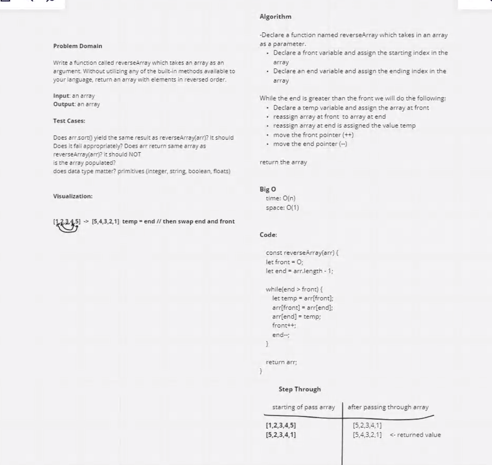

# Reverse an Array
<!-- Description of the challenge -->

Write a function called reverseArray which takes an array as an argument. Without utilizing any of the built-in methods available to your language, return an array with elements in reversed order.

## Whiteboard Process

## Approach & Efficiency
<!-- What approach did you take? Discuss Why. What is the Big O space/time for this approach? -->

Struggling to understand what the Big O piece is. But for today's challenge we followed along with Ryan.
